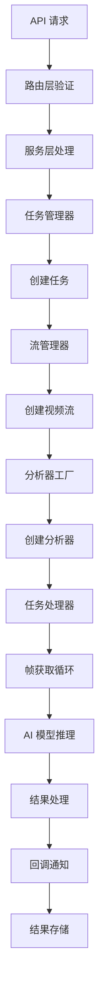

# N-MeekYolo 分析服务 - 完整项目架构分析报告

## 1. 项目概述

### 1.1 项目简介
N-MeekYolo 分析服务是一个基于 FastAPI 的现代化视频流分析系统，专注于实时视频流处理、AI 模型推理和多协议媒体支持。该项目采用微服务架构设计，支持多种 YOLO 模型（包括 YOLOE）、多种推理引擎，并集成了 ZLMediaKit 流媒体服务器，提供了完整的视频分析解决方案。

### 1.2 核心特性
- **多协议支持**: RTSP、RTMP、HLS、WebRTC、GB28181、ONVIF 等
- **多模型支持**: YOLOv8、YOLO11、YOLOE 系列模型
- **多引擎支持**: PyTorch、ONNX、TensorRT、OpenVINO、Pytron
- **实时分析**: 目标检测、跟踪、分割、跨摄像头跟踪、越界检测
- **异步架构**: 基于 asyncio 的高性能异步处理
- **流媒体集成**: 深度集成 ZLMediaKit 流媒体服务器

### 1.3 技术栈
- **后端框架**: FastAPI + Uvicorn
- **异步处理**: asyncio + aiohttp
- **AI 框架**: Ultralytics YOLO + PyTorch
- **流媒体**: ZLMediaKit (C++ 库)
- **数据存储**: Redis + 本地文件系统
- **配置管理**: Pydantic Settings + python-dotenv
- **日志系统**: Loguru + 自定义日志管理器
- **图像处理**: OpenCV + NumPy

## 2. 项目架构设计

### 2.1 整体架构
项目采用分层架构设计，遵循单一职责原则和依赖倒置原则：

```
┌─────────────────────────────────────────────────────────────┐
│                    API 层 (FastAPI)                        │
├─────────────────────────────────────────────────────────────┤
│                    路由层 (Routers)                        │
├─────────────────────────────────────────────────────────────┤
│                    服务层 (Services)                       │
├─────────────────────────────────────────────────────────────┤
│                    核心层 (Core)                           │
│  ┌─────────────┬─────────────┬─────────────┬─────────────┐  │
│  │   分析器    │  任务管理   │  媒体处理   │   配置管理  │  │
│  │ (Analyzer)  │(TaskMgmt)   │(MediaKit)   │  (Config)   │  │
│  └─────────────┴─────────────┴─────────────┴─────────────┘  │
├─────────────────────────────────────────────────────────────┤
│                    数据层 (Models)                         │
├─────────────────────────────────────────────────────────────┤
│                    基础设施层 (Shared)                     │
└─────────────────────────────────────────────────────────────┘
```

### 2.2 模块职责划分

#### 2.2.1 应用入口层
- **app.py**: 应用主入口，负责导入和启动应用
- **run/run.py**: 应用启动管理，包含生命周期管理、中间件配置、路由注册

#### 2.2.2 API 路由层 (routers/)
- **task.py**: 任务管理 API（启动、停止、查询任务）
- **health.py**: 健康检查 API
- **task_video.py**: 视频预览和实时流 API

#### 2.2.3 服务层 (services/)
- **http/task_service.py**: HTTP 模式任务服务
- **http/callback_service.py**: 回调服务
- **http/video_encoder_service.py**: 视频编码服务
- **analysis_service.py**: 分析服务协调器
- **service_factory.py**: 服务工厂

#### 2.2.4 核心业务层 (core/)
- **analyzer/**: 分析器模块（检测、跟踪、分割等）
- **task_management/**: 任务管理模块
- **media_kit/**: 媒体处理模块（ZLMediaKit 集成）
- **config.py**: 配置管理

#### 2.2.5 数据模型层 (models/)
- **requests.py**: API 请求模型
- **responses.py**: API 响应模型
- **task.py**: 任务数据模型
- **analysis_type.py**: 分析类型定义

#### 2.2.6 共享基础层 (shared/)
- **utils/logger.py**: 日志管理
- **utils/tools.py**: 通用工具函数
- **config/**: 配置基类和设置

## 3. 核心模块详细分析

### 3.1 任务管理模块 (core/task_management/)

#### 3.1.1 设计模式
- **管理器模式**: TaskManager 作为任务生命周期管理器
- **处理器模式**: TaskProcessor 负责具体任务执行
- **观察者模式**: 任务状态变化通知机制
- **工厂模式**: 任务创建和分配

#### 3.1.2 核心组件
```python
# 任务管理器
class TaskManager:
    - 任务创建、启动、停止、查询
    - 任务状态管理和持久化
    - 资源分配和限制控制
    - 任务清理和维护

# 任务处理器
class TaskProcessor:
    - 流分析任务执行
    - 帧获取和分析循环
    - 结果处理和分发
    - 错误处理和重试机制

# 流管理器
class StreamManager:
    - 视频流创建和管理
    - 流健康监控
    - 订阅者管理
    - 流资源清理
```

#### 3.1.3 任务状态流转
```
WAITING → PROCESSING → COMPLETED
    ↓         ↓           ↓
  FAILED ← STOPPING → STOPPED
```

### 3.2 分析器模块 (core/analyzer/)

#### 3.1.1 设计模式
- **抽象工厂模式**: AnalyzerFactory 创建不同类型分析器
- **策略模式**: 不同分析算法的可插拔实现
- **模板方法模式**: BaseAnalyzer 定义分析流程模板
- **适配器模式**: 不同模型引擎的统一接口

#### 3.1.2 分析器类型
```python
# 基础分析器
BaseAnalyzer (抽象基类)
├── DetectionAnalyzer (检测分析器)
│   ├── YOLODetectionAnalyzer
│   └── YOLOEDetectionAnalyzer
├── TrackingAnalyzer (跟踪分析器)
├── SegmentationAnalyzer (分割分析器)
├── CrossCameraTrackingAnalyzer (跨摄像头跟踪)
└── LineCrossingAnalyzer (越界检测)
```

#### 3.1.3 模型支持矩阵
| 模型类型 | PyTorch | ONNX | TensorRT | OpenVINO | Pytron |
|---------|---------|------|----------|----------|--------|
| YOLOv8  | ✅      | ✅   | 🔄       | 🔄       | ❌     |
| YOLO11  | ✅      | ✅   | 🔄       | 🔄       | ❌     |
| YOLOE   | ✅      | ❌   | ❌       | ❌       | ❌     |

*✅ 完全支持, 🔄 部分支持, ❌ 不支持*

### 3.3 媒体处理模块 (core/media_kit/)

#### 3.3.1 架构设计
```python
# ZLMediaKit 管理器
ZLMManager:
    - C API 和 HTTP API 双重支持
    - 流代理创建和管理
    - 服务器状态监控
    - 资源清理和释放

# ZLM 视频流
ZLMVideoStream:
    - 流拉取和推送
    - 帧缓冲管理
    - 订阅者模式
    - 健康状态监控
```

#### 3.3.2 协议支持
- **RTSP**: 完整支持，TCP/UDP 传输
- **RTMP**: 完整支持，推拉流
- **HLS**: 支持 TS 和 FMP4 分片
- **WebRTC**: 支持 WHEP/WHIP 协议
- **GB28181**: 通过 ZLMediaKit 集成
- **HTTP**: 静态文件和 MJPEG 流

## 4. 数据流分析

### 4.1 任务执行流程


### 4.2 视频流处理流程


## 5. 详细目录结构和功能清单

### 5.1 项目根目录结构
```
analysis_service/
├── app.py                          # 应用主入口文件
├── requirements.txt                 # Python 依赖包列表
├── requirements.lock               # 锁定版本的依赖包
├── run.sh                          # 启动脚本
├── tag_list.txt                    # YOLOE 模型类别标签文件
├── request_example.json            # API 请求示例
├── test_plan.md                    # 测试计划文档
├── ZLMediaKit/                     # ZLMediaKit 源码目录
├── zlmos/                          # ZLMediaKit 编译产物
├── lib/                            # 动态链接库目录
├── config/                         # 配置文件目录
├── core/                           # 核心业务逻辑
├── models/                         # 数据模型定义
├── routers/                        # API 路由定义
├── run/                            # 应用启动管理
├── services/                       # 服务层实现
├── shared/                         # 共享工具和基础设施
├── crud/                           # 数据访问层
├── data/                           # 数据存储目录
├── docs/                           # 项目文档
├── tests/                          # 测试代码
├── static/                         # 静态文件
├── temp/                           # 临时文件目录
├── results/                        # 分析结果存储
├── reports/                        # 报告文件
├── public/                         # 公共资源
└── venv/                           # Python 虚拟环境
```

### 5.2 核心模块详细结构

#### 5.2.1 core/ 核心模块
```
core/
├── __init__.py                     # 核心模块导出
├── config.py                       # 配置管理
├── exceptions.py                   # 异常定义
├── models.py                       # 核心数据模型
├── redis_manager.py                # Redis 连接管理
├── resource.py                     # 资源监控
├── analyzer/                       # 分析器模块
│   ├── __init__.py
│   ├── analyzer_factory.py         # 分析器工厂
│   ├── base_analyzer.py            # 分析器基类
│   ├── model_loader.py             # 模型加载器
│   ├── detection/                  # 检测分析器
│   │   ├── __init__.py
│   │   ├── yolo_detection_analyzer.py
│   │   ├── yolo_detector.py
│   │   └── yoloe_detector.py
│   ├── tracking/                   # 跟踪分析器
│   │   ├── __init__.py
│   │   ├── tracker.py
│   │   ├── yolo_tracker.py
│   │   └── yoloe_tracker.py
│   ├── segmentation/               # 分割分析器
│   │   ├── __init__.py
│   │   ├── yolo_segmentor.py
│   │   └── yoloe_segmentor.py
│   ├── cross_camera/               # 跨摄像头跟踪
│   │   ├── __init__.py
│   │   ├── cross_camera_tracker.py
│   │   └── feature_extractor.py
│   ├── line_crossing/              # 越界检测
│   │   ├── __init__.py
│   │   └── line_crossing_detector.py
│   └── yoloe/                      # YOLOE 专用分析器
│       ├── __init__.py
│       ├── yoloe_analyzer.py
│       └── yoloe_analyzer_patch.py
├── task_management/                # 任务管理模块
│   ├── __init__.py
│   ├── manager.py                  # 任务管理器
│   ├── processor.py                # 任务处理器
│   ├── queue.py                    # 任务队列
│   ├── stream/                     # 流管理
│   │   ├── __init__.py
│   │   ├── manager.py              # 流管理器
│   │   ├── base_stream.py          # 流基类
│   │   ├── interface.py            # 流接口定义
│   │   ├── status.py               # 状态定义
│   │   ├── health_monitor.py       # 健康监控
│   │   ├── node_monitor.py         # 节点监控
│   │   └── stream_task_bridge.py   # 流任务桥接
│   └── utils/                      # 工具类
│       └── status.py               # 状态工具
└── media_kit/                      # 媒体处理模块
    ├── __init__.py
    ├── zlm_manager.py              # ZLMediaKit 管理器
    ├── zlm_stream.py               # ZLM 视频流
    ├── zlm_config.py               # ZLM 配置
    ├── zlm_bridge.py               # ZLM 桥接
    ├── base/                       # 基础组件
    │   ├── __init__.py
    │   ├── base_stream.py          # 流基类
    │   ├── config_manager.py       # 配置管理器
    │   ├── event_system.py         # 事件系统
    │   ├── stream_interface.py     # 流接口
    │   └── stream_manager.py       # 流管理器
    ├── bridge/                     # 桥接组件
    │   ├── __init__.py
    │   └── analyzer_bridge.py      # 分析器桥接
    ├── factory/                    # 工厂组件
    │   ├── __init__.py
    │   ├── protocol_factory.py     # 协议工厂
    │   └── stream_factory.py       # 流工厂
    ├── protocols/                  # 协议支持
    │   ├── __init__.py
    │   ├── rtsp/                   # RTSP 协议
    │   ├── rtmp/                   # RTMP 协议
    │   ├── hls/                    # HLS 协议
    │   ├── webrtc/                 # WebRTC 协议
    │   ├── gb28181/                # GB28181 协议
    │   ├── onvif/                  # ONVIF 协议
    │   └── http/                   # HTTP 协议
    ├── service/                    # 服务组件
    │   ├── __init__.py
    │   └── zlm_service.py          # ZLM 服务
    └── utils/                      # 工具组件
        ├── __init__.py
        ├── health_check.py         # 健康检查
        └── status_monitor.py       # 状态监控
```

#### 5.2.2 services/ 服务层
```
services/
├── __init__.py                     # 服务模块导出
├── analysis_service.py             # 分析服务协调器
├── base_analyzer.py                # 分析服务基类
├── service_factory.py              # 服务工厂
├── task_store.py                   # 任务存储服务
├── task_worker.py                  # 任务工作器
└── http/                           # HTTP 模式服务
    ├── __init__.py
    ├── task_service.py             # 任务服务
    ├── callback_service.py         # 回调服务
    ├── http_analyzer.py            # HTTP 分析器
    └── video_encoder_service.py    # 视频编码服务
```

#### 5.2.3 routers/ 路由层
```
routers/
├── __init__.py                     # 路由模块导出
├── task.py                         # 任务管理 API
├── health.py                       # 健康检查 API
└── task_video.py                   # 视频预览 API
```

#### 5.2.4 models/ 数据模型
```
models/
├── analysis_type.py                # 分析类型定义
├── requests.py                     # API 请求模型
├── responses.py                    # API 响应模型
└── task.py                         # 任务数据模型
```

### 5.3 功能模块映射表

| 功能模块 | 主要文件 | 核心类/函数 | 功能描述 |
|---------|---------|------------|----------|
| **应用启动** | app.py, run/run.py | create_app(), main() | 应用入口和生命周期管理 |
| **任务管理** | core/task_management/manager.py | TaskManager | 任务创建、启动、停止、查询 |
| **任务处理** | core/task_management/processor.py | TaskProcessor | 任务执行和流程控制 |
| **流管理** | core/task_management/stream/manager.py | StreamManager | 视频流创建和管理 |
| **分析器工厂** | core/analyzer/analyzer_factory.py | AnalyzerFactory | 分析器创建和类型管理 |
| **YOLO检测** | core/analyzer/detection/ | YOLODetectionAnalyzer | 基于YOLO的目标检测 |
| **YOLOE检测** | core/analyzer/yoloe/ | YOLOEAnalyzer | YOLOE模型专用分析器 |
| **目标跟踪** | core/analyzer/tracking/ | YOLOTracker | 目标跟踪算法实现 |
| **实例分割** | core/analyzer/segmentation/ | YOLOSegmentor | 实例分割功能 |
| **跨摄像头跟踪** | core/analyzer/cross_camera/ | CrossCameraTracker | 跨摄像头目标关联 |
| **越界检测** | core/analyzer/line_crossing/ | LineCrossingDetector | 越界检测和报警 |
| **ZLM管理** | core/media_kit/zlm_manager.py | ZLMManager | ZLMediaKit服务管理 |
| **视频流** | core/media_kit/zlm_stream.py | ZLMVideoStream | 视频流处理和分发 |
| **协议支持** | core/media_kit/protocols/ | 各协议实现类 | 多协议视频流支持 |
| **任务API** | routers/task.py | start_task(), stop_task() | 任务管理REST API |
| **健康检查** | routers/health.py | health_check() | 系统健康状态API |
| **视频预览** | routers/task_video.py | preview_api() | 实时视频预览API |
| **配置管理** | core/config.py | Settings | 应用配置和环境变量 |
| **日志管理** | shared/utils/logger.py | get_logger() | 日志记录和管理 |
| **异常处理** | core/exceptions.py | 各异常类 | 统一异常定义和处理 |

## 6. 架构设计评估

### 6.1 设计模式应用分析

#### 6.1.1 优秀的设计模式应用

**1. 工厂模式 (Factory Pattern)**
- **应用位置**: `AnalyzerFactory`, `ServiceFactory`
- **优点**:
  - 统一了分析器创建逻辑，支持多种分析类型
  - 便于扩展新的分析器类型
  - 隐藏了具体实现细节
- **符合标准**: ✅ 完全符合工厂模式设计原则

**2. 单例模式 (Singleton Pattern)**
- **应用位置**: `TaskManager`, `StreamManager`, `ZLMManager`
- **优点**:
  - 确保全局唯一实例，避免资源冲突
  - 提供全局访问点
- **符合标准**: ✅ 正确实现了线程安全的单例

**3. 观察者模式 (Observer Pattern)**
- **应用位置**: 任务状态变化通知、流状态监控
- **优点**:
  - 松耦合的事件通知机制
  - 支持多个观察者订阅同一事件
- **符合标准**: ✅ 实现了异步事件通知机制

**4. 策略模式 (Strategy Pattern)**
- **应用位置**: 不同分析算法的实现
- **优点**:
  - 算法可插拔，易于扩展
  - 运行时可切换不同策略
- **符合标准**: ✅ 通过基类抽象实现了策略模式

**5. 适配器模式 (Adapter Pattern)**
- **应用位置**: ZLMediaKit C API 和 HTTP API 的统一接口
- **优点**:
  - 统一了不同接口的访问方式
  - 提高了代码复用性
- **符合标准**: ✅ 很好地适配了第三方库接口

#### 6.1.2 架构层次分析

**分层架构评估**:
```
API层 → 路由层 → 服务层 → 核心层 → 数据层
```

**优点**:
- ✅ 层次清晰，职责分明
- ✅ 依赖方向正确（上层依赖下层）
- ✅ 每层都有明确的抽象边界

**改进建议**:
- 🔄 可以考虑引入领域层（Domain Layer）来更好地封装业务逻辑
- 🔄 增加基础设施层（Infrastructure Layer）来统一管理外部依赖

### 6.2 代码质量评估

#### 6.2.1 优点分析

**1. 模块化程度高**
- 每个模块都有明确的职责边界
- 模块间通过接口进行通信
- 支持独立开发和测试

**2. 异步编程实践**
- 全面采用 asyncio 异步编程模型
- 正确使用 async/await 语法
- 避免了阻塞操作对性能的影响

**3. 配置管理规范**
- 使用 Pydantic Settings 进行配置管理
- 支持环境变量和配置文件
- 配置项有类型检查和验证

**4. 错误处理完善**
- 定义了统一的异常体系
- 实现了全局异常处理器
- 错误信息记录详细

**5. 日志管理规范**
- 使用 Loguru 进行日志管理
- 支持不同级别的日志记录
- 日志格式统一，便于分析

#### 6.2.2 需要改进的方面

**1. 依赖注入不够完善**
- 部分组件仍然使用硬编码依赖
- 缺少统一的依赖注入容器
- 建议引入依赖注入框架（如 dependency-injector）

**2. 测试覆盖率有待提高**
- 单元测试覆盖率不足
- 缺少集成测试和端到端测试
- 需要建立完整的测试体系

**3. 文档完整性**
- API 文档相对完善
- 缺少架构设计文档
- 需要补充开发者指南

### 6.3 性能分析

#### 6.3.1 性能优势

**1. 异步处理架构**
- 使用 asyncio 实现高并发处理
- 非阻塞 I/O 操作提高吞吐量
- 支持多任务并行执行

**2. 流媒体优化**
- 集成 ZLMediaKit 高性能流媒体服务器
- 支持多种协议和编码格式
- 实现了流复用和资源共享

**3. 模型推理优化**
- 支持多种推理引擎（PyTorch、ONNX、TensorRT）
- 实现了模型缓存和复用
- 支持 GPU 加速

#### 6.3.2 性能瓶颈

**1. 内存管理**
- 视频帧缓存可能占用大量内存
- 缺少内存使用监控和限制
- 需要实现更智能的缓存策略

**2. CPU 密集型任务**
- AI 模型推理仍然是 CPU 密集型
- 缺少负载均衡机制
- 需要考虑分布式处理

**3. 数据库访问**
- Redis 访问可能成为瓶颈
- 缺少连接池优化
- 需要实现数据分片

### 6.4 可扩展性评估

#### 6.4.1 水平扩展能力

**优点**:
- ✅ 无状态服务设计，支持多实例部署
- ✅ 任务队列支持分布式处理
- ✅ 流媒体服务可独立扩展

**改进空间**:
- 🔄 需要实现服务发现和负载均衡
- 🔄 缺少分布式锁和协调机制
- 🔄 需要考虑数据一致性问题

#### 6.4.2 垂直扩展能力

**优点**:
- ✅ 支持多 GPU 并行处理
- ✅ 可配置的并发限制
- ✅ 资源监控和管理

**改进空间**:
- 🔄 需要更智能的资源分配策略
- 🔄 缺少动态扩缩容机制
- 🔄 需要实现更细粒度的资源控制

### 6.5 安全性评估

#### 6.5.1 安全优势

**1. 输入验证**
- 使用 Pydantic 进行数据验证
- API 参数类型检查
- 防止注入攻击

**2. 错误处理**
- 不暴露敏感系统信息
- 统一的错误响应格式
- 详细的安全日志记录

#### 6.5.2 安全改进建议

**1. 身份认证和授权**
- 缺少 API 身份认证机制
- 需要实现基于角色的访问控制
- 建议集成 OAuth2 或 JWT

**2. 数据加密**
- 敏感配置信息需要加密存储
- API 通信需要 HTTPS 支持
- 数据传输需要加密

**3. 安全审计**
- 需要实现安全审计日志
- 建立安全事件监控
- 定期进行安全扫描

## 7. 符合大系统框架设计标准评估

### 7.1 架构原则符合性

#### 7.1.1 SOLID 原则评估

**单一职责原则 (SRP)**: ✅ 优秀
- 每个类和模块都有明确的单一职责
- 任务管理、流处理、分析器等模块职责清晰

**开闭原则 (OCP)**: ✅ 良好
- 通过工厂模式和抽象基类支持扩展
- 新增分析器类型无需修改现有代码

**里氏替换原则 (LSP)**: ✅ 良好
- 分析器基类的子类可以完全替换基类
- 接口实现遵循契约

**接口隔离原则 (ISP)**: 🔄 需要改进
- 部分接口过于庞大，可以进一步拆分
- 建议按功能拆分更细粒度的接口

**依赖倒置原则 (DIP)**: 🔄 部分符合
- 高层模块依赖抽象而非具体实现
- 但依赖注入机制不够完善

#### 7.1.2 微服务架构原则

**服务自治**: ✅ 符合
- 每个服务模块相对独立
- 具有独立的数据存储和处理逻辑

**去中心化**: 🔄 部分符合
- 任务管理相对集中化
- 可以考虑进一步分解为更小的服务

**容错性**: ✅ 良好
- 实现了重试机制和错误恢复
- 服务间故障隔离

**可观测性**: 🔄 需要改进
- 日志记录较为完善
- 缺少指标监控和链路追踪

### 7.2 企业级特性评估

#### 7.2.1 高可用性

**优点**:
- ✅ 异步处理避免单点阻塞
- ✅ 流媒体服务支持故障转移
- ✅ 任务重试和恢复机制

**改进建议**:
- 🔄 实现服务健康检查
- 🔄 增加熔断器模式
- 🔄 建立灾难恢复机制

#### 7.2.2 可维护性

**优点**:
- ✅ 代码结构清晰，模块化程度高
- ✅ 配置外部化，便于环境切换
- ✅ 日志记录详细，便于问题排查

**改进建议**:
- 🔄 增加代码质量检查工具
- 🔄 建立自动化部署流程
- 🔄 完善监控和告警机制

#### 7.2.3 可测试性

**优点**:
- ✅ 模块间松耦合，便于单元测试
- ✅ 依赖抽象，便于 Mock 测试
- ✅ 异步代码测试框架完善

**改进建议**:
- 🔄 提高测试覆盖率
- 🔄 建立持续集成流程
- 🔄 增加性能测试和压力测试

## 8. 改进建议和优化方案

### 8.1 架构优化建议

#### 8.1.1 引入领域驱动设计 (DDD)

**当前问题**: 业务逻辑分散在各个服务层，缺少统一的领域模型

**改进方案**:
```python
# 建议的领域层结构
domain/
├── entities/           # 实体
│   ├── task.py        # 任务实体
│   ├── stream.py      # 流实体
│   └── analysis.py    # 分析实体
├── value_objects/     # 值对象
│   ├── stream_url.py  # 流地址值对象
│   └── roi.py         # ROI 值对象
├── aggregates/        # 聚合根
│   └── analysis_task.py
├── repositories/      # 仓储接口
│   └── task_repository.py
└── services/          # 领域服务
    └── analysis_service.py
```

**预期收益**:
- 业务逻辑更加内聚
- 提高代码可读性和可维护性
- 便于业务规则的统一管理

#### 8.1.2 实现事件驱动架构

**当前问题**: 模块间耦合度较高，缺少异步事件处理机制

**改进方案**:
```python
# 事件系统设计
events/
├── base.py           # 事件基类
├── task_events.py    # 任务相关事件
├── stream_events.py  # 流相关事件
└── handlers/         # 事件处理器
    ├── task_handlers.py
    └── stream_handlers.py

# 事件示例
class TaskStartedEvent(BaseEvent):
    task_id: str
    stream_url: str
    timestamp: datetime

class TaskCompletedEvent(BaseEvent):
    task_id: str
    result: AnalysisResult
    timestamp: datetime
```

**预期收益**:
- 降低模块间耦合度
- 提高系统响应性
- 便于实现复杂的业务流程

#### 8.1.3 引入 CQRS 模式

**当前问题**: 读写操作混合在一起，影响性能和可扩展性

**改进方案**:
```python
# CQRS 结构
cqrs/
├── commands/         # 命令（写操作）
│   ├── start_task.py
│   └── stop_task.py
├── queries/          # 查询（读操作）
│   ├── get_task_status.py
│   └── list_tasks.py
├── handlers/         # 处理器
│   ├── command_handlers.py
│   └── query_handlers.py
└── projections/      # 投影（读模型）
    └── task_projection.py
```

**预期收益**:
- 读写分离，提高性能
- 便于独立优化和扩展
- 支持复杂查询场景

### 8.2 技术栈优化建议

#### 8.2.1 引入依赖注入框架

**推荐方案**: 使用 `dependency-injector` 框架

```python
# 容器配置示例
from dependency_injector import containers, providers

class Container(containers.DeclarativeContainer):
    # 配置
    config = providers.Configuration()

    # 基础设施
    redis_client = providers.Singleton(
        Redis,
        host=config.redis.host,
        port=config.redis.port
    )

    # 仓储
    task_repository = providers.Factory(
        TaskRepository,
        redis_client=redis_client
    )

    # 服务
    task_service = providers.Factory(
        TaskService,
        task_repository=task_repository
    )
```

#### 8.2.2 集成监控和可观测性

**推荐技术栈**:
- **指标监控**: Prometheus + Grafana
- **链路追踪**: Jaeger 或 Zipkin
- **日志聚合**: ELK Stack (Elasticsearch + Logstash + Kibana)

```python
# 监控集成示例
from prometheus_client import Counter, Histogram, Gauge

# 指标定义
task_counter = Counter('tasks_total', 'Total number of tasks', ['status'])
task_duration = Histogram('task_duration_seconds', 'Task duration')
active_streams = Gauge('active_streams', 'Number of active streams')

# 使用示例
@task_duration.time()
async def process_task(task_id: str):
    task_counter.labels(status='started').inc()
    try:
        # 任务处理逻辑
        result = await execute_task(task_id)
        task_counter.labels(status='completed').inc()
        return result
    except Exception as e:
        task_counter.labels(status='failed').inc()
        raise
```

#### 8.2.3 实现分布式缓存

**推荐方案**: Redis Cluster + 本地缓存

```python
# 多级缓存设计
cache/
├── local_cache.py    # 本地缓存（内存）
├── redis_cache.py    # Redis 缓存
└── cache_manager.py  # 缓存管理器

class CacheManager:
    def __init__(self, local_cache, redis_cache):
        self.local_cache = local_cache
        self.redis_cache = redis_cache

    async def get(self, key: str):
        # 先查本地缓存
        value = await self.local_cache.get(key)
        if value is not None:
            return value

        # 再查 Redis
        value = await self.redis_cache.get(key)
        if value is not None:
            # 回写本地缓存
            await self.local_cache.set(key, value)
            return value

        return None
```

### 8.3 性能优化建议

#### 8.3.1 实现智能负载均衡

```python
# 负载均衡器设计
class LoadBalancer:
    def __init__(self):
        self.workers = []
        self.current_loads = {}

    def select_worker(self, task_type: str) -> str:
        """基于任务类型和当前负载选择工作器"""
        available_workers = [
            w for w in self.workers
            if self.current_loads[w.id] < w.max_capacity
        ]

        if not available_workers:
            raise NoAvailableWorkerError()

        # 选择负载最低的工作器
        return min(available_workers, key=lambda w: self.current_loads[w.id])
```

#### 8.3.2 优化内存使用

```python
# 内存池管理
class FrameBufferPool:
    def __init__(self, max_size: int = 100):
        self.max_size = max_size
        self.buffers = asyncio.Queue(maxsize=max_size)
        self.in_use = set()

    async def acquire(self) -> np.ndarray:
        """获取缓冲区"""
        try:
            buffer = self.buffers.get_nowait()
        except asyncio.QueueEmpty:
            buffer = np.zeros((720, 1280, 3), dtype=np.uint8)

        self.in_use.add(id(buffer))
        return buffer

    async def release(self, buffer: np.ndarray):
        """释放缓冲区"""
        buffer_id = id(buffer)
        if buffer_id in self.in_use:
            self.in_use.remove(buffer_id)
            try:
                self.buffers.put_nowait(buffer)
            except asyncio.QueueFull:
                # 缓冲区已满，直接丢弃
                pass
```

#### 8.3.3 实现自适应处理策略

```python
# 自适应帧率控制
class AdaptiveFrameProcessor:
    def __init__(self):
        self.target_fps = 30
        self.current_load = 0.0
        self.skip_frames = 0

    def should_process_frame(self, frame_index: int) -> bool:
        """根据系统负载决定是否处理当前帧"""
        if self.current_load > 0.8:  # 高负载
            self.skip_frames = max(2, self.skip_frames)
        elif self.current_load > 0.6:  # 中等负载
            self.skip_frames = max(1, self.skip_frames)
        else:  # 低负载
            self.skip_frames = 0

        return frame_index % (self.skip_frames + 1) == 0
```

### 8.4 安全性增强建议

#### 8.4.1 实现 API 认证授权

```python
# JWT 认证实现
from fastapi import Depends, HTTPException, status
from fastapi.security import HTTPBearer, HTTPAuthorizationCredentials

security = HTTPBearer()

async def verify_token(credentials: HTTPAuthorizationCredentials = Depends(security)):
    """验证 JWT Token"""
    try:
        payload = jwt.decode(credentials.credentials, SECRET_KEY, algorithms=[ALGORITHM])
        user_id = payload.get("sub")
        if user_id is None:
            raise HTTPException(status_code=401, detail="Invalid token")
        return user_id
    except JWTError:
        raise HTTPException(status_code=401, detail="Invalid token")

# 权限控制装饰器
def require_permission(permission: str):
    def decorator(func):
        async def wrapper(*args, **kwargs):
            user_id = kwargs.get('current_user')
            if not has_permission(user_id, permission):
                raise HTTPException(status_code=403, detail="Insufficient permissions")
            return await func(*args, **kwargs)
        return wrapper
    return decorator
```

#### 8.4.2 数据加密和脱敏

```python
# 敏感数据处理
class DataProtection:
    def __init__(self, encryption_key: str):
        self.cipher = Fernet(encryption_key.encode())

    def encrypt_sensitive_data(self, data: str) -> str:
        """加密敏感数据"""
        return self.cipher.encrypt(data.encode()).decode()

    def decrypt_sensitive_data(self, encrypted_data: str) -> str:
        """解密敏感数据"""
        return self.cipher.decrypt(encrypted_data.encode()).decode()

    def mask_sensitive_info(self, data: dict) -> dict:
        """脱敏处理"""
        sensitive_fields = ['password', 'token', 'secret']
        masked_data = data.copy()

        for field in sensitive_fields:
            if field in masked_data:
                masked_data[field] = '*' * 8

        return masked_data
```

### 8.5 测试策略改进

#### 8.5.1 建立完整的测试金字塔

```python
# 测试结构
tests/
├── unit/              # 单元测试
│   ├── test_analyzers.py
│   ├── test_task_manager.py
│   └── test_stream_manager.py
├── integration/       # 集成测试
│   ├── test_api_endpoints.py
│   ├── test_zlm_integration.py
│   └── test_database_operations.py
├── e2e/              # 端到端测试
│   ├── test_full_workflow.py
│   └── test_user_scenarios.py
├── performance/       # 性能测试
│   ├── test_load.py
│   └── test_stress.py
└── fixtures/         # 测试数据
    ├── sample_videos/
    └── mock_responses/
```

#### 8.5.2 实现自动化测试流程

```yaml
# GitHub Actions 配置示例
name: CI/CD Pipeline

on: [push, pull_request]

jobs:
  test:
    runs-on: ubuntu-latest
    steps:
      - uses: actions/checkout@v2
      - name: Set up Python
        uses: actions/setup-python@v2
        with:
          python-version: 3.10

      - name: Install dependencies
        run: |
          pip install -r requirements.txt
          pip install -r requirements-test.txt

      - name: Run unit tests
        run: pytest tests/unit/ --cov=core --cov-report=xml

      - name: Run integration tests
        run: pytest tests/integration/

      - name: Upload coverage
        uses: codecov/codecov-action@v1
```

## 9. 总结和结论

### 9.1 项目整体评估

**N-MeekYolo 分析服务**是一个设计良好、功能完整的视频流分析系统。项目在以下方面表现优秀：

#### 9.1.1 架构优势
- ✅ **模块化设计**: 清晰的分层架构，职责分明
- ✅ **异步处理**: 全面采用 asyncio，支持高并发
- ✅ **可扩展性**: 工厂模式和插件化设计支持功能扩展
- ✅ **技术选型**: 使用现代化的技术栈，性能优秀
- ✅ **集成能力**: 深度集成 ZLMediaKit，支持多种协议

#### 9.1.2 功能完整性
- ✅ **多模型支持**: YOLOv8、YOLO11、YOLOE 等
- ✅ **多引擎支持**: PyTorch、ONNX、TensorRT 等
- ✅ **分析能力**: 检测、跟踪、分割、跨摄像头跟踪等
- ✅ **协议支持**: RTSP、RTMP、HLS、WebRTC、GB28181 等
- ✅ **API 设计**: RESTful API，文档完善

#### 9.1.3 代码质量
- ✅ **编码规范**: 遵循 PEP 8 和最佳实践
- ✅ **错误处理**: 完善的异常体系和错误恢复
- ✅ **配置管理**: 灵活的配置系统
- ✅ **日志管理**: 详细的日志记录和分级

### 9.2 符合大系统框架设计标准评估

#### 9.2.1 设计原则符合度

| 设计原则 | 符合度 | 评分 | 说明 |
|---------|--------|------|------|
| **单一职责原则** | ✅ 优秀 | 9/10 | 模块职责清晰，边界明确 |
| **开闭原则** | ✅ 良好 | 8/10 | 支持扩展，工厂模式应用得当 |
| **里氏替换原则** | ✅ 良好 | 8/10 | 接口实现规范，可替换性强 |
| **接口隔离原则** | 🔄 一般 | 6/10 | 部分接口过于庞大，需要拆分 |
| **依赖倒置原则** | 🔄 一般 | 7/10 | 依赖抽象，但注入机制不完善 |

#### 9.2.2 企业级特性评估

| 特性 | 符合度 | 评分 | 说明 |
|------|--------|------|------|
| **高可用性** | ✅ 良好 | 7/10 | 有重试机制，但缺少熔断器 |
| **可扩展性** | ✅ 优秀 | 8/10 | 支持水平和垂直扩展 |
| **可维护性** | ✅ 良好 | 8/10 | 代码结构清晰，文档较完善 |
| **可测试性** | 🔄 一般 | 6/10 | 架构支持测试，但覆盖率不足 |
| **安全性** | 🔄 一般 | 5/10 | 基础安全措施，但缺少认证授权 |
| **性能** | ✅ 良好 | 8/10 | 异步架构，性能优秀 |

#### 9.2.3 总体评分

**综合评分**: 7.5/10 (良好)

**评估结论**: 项目整体架构设计符合大系统框架设计标准，在模块化、可扩展性、性能等方面表现优秀，但在依赖注入、测试覆盖率、安全性等方面还有改进空间。

### 9.3 改进优先级建议

#### 9.3.1 高优先级 (立即实施)
1. **完善依赖注入机制** - 引入 DI 框架，提高代码可测试性
2. **增强安全性** - 实现 API 认证授权机制
3. **提高测试覆盖率** - 建立完整的测试体系
4. **完善监控体系** - 集成指标监控和链路追踪

#### 9.3.2 中优先级 (近期实施)
1. **引入事件驱动架构** - 降低模块间耦合度
2. **实现 CQRS 模式** - 提高读写性能
3. **优化性能瓶颈** - 实现智能负载均衡和内存优化
4. **增强错误处理** - 实现熔断器和降级机制

#### 9.3.3 低优先级 (长期规划)
1. **引入领域驱动设计** - 重构业务逻辑
2. **实现分布式架构** - 支持大规模部署
3. **云原生改造** - 支持容器化和微服务
4. **AI 能力增强** - 集成更多 AI 模型和算法

### 9.4 最终结论

N-MeekYolo 分析服务是一个**架构设计良好、功能完整、技术先进**的视频流分析系统。项目在模块化设计、异步处理、可扩展性等方面表现优秀，基本符合大系统框架设计标准。

通过实施建议的改进方案，该项目可以进一步提升到企业级产品的标准，成为一个高可用、高性能、高安全性的视频分析解决方案。

**推荐指数**: ⭐⭐⭐⭐☆ (4/5 星)

项目具有很好的基础架构和发展潜力，值得继续投入和完善。
