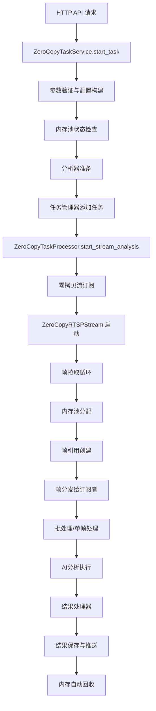

# 任务启动接口到零拷贝完整流程分析与问题识别

## 📋 分析概述

本文档全面分析从任务启动接口到零拷贝架构的完整流程，识别不合理的代码和设计问题，并提供优化建议。

## 🔄 完整流程图



## 🚨 关键问题识别

### 1. 任务启动接口层问题

#### 1.1 响应时机不合理 ❌

**问题位置**: `services/http/zero_copy_task_service.py:110-112`

```python
# 启动零拷贝任务
success = await self._start_zero_copy_task(task_id, task_config, analyzer)
if not success:
    raise RuntimeError("启动零拷贝任务失败")
```

**问题分析**:
- API接口在所有初始化完成后才返回响应
- 内存操作（内存池分配、流连接）可能耗时较长
- 违反了用户期望的"立即返回"原则

**影响**:
- 接口响应时间过长（可能5-10秒）
- 客户端可能超时
- 用户体验差

#### 1.2 错误处理粒度过粗 ❌

**问题位置**: `services/http/zero_copy_task_service.py:137-144`

```python
except Exception as e:
    exception_logger.exception(f"创建零拷贝任务失败: {str(e)}")
    return {
        "success": False,
        "message": f"创建零拷贝任务失败: {str(e)}",
        "task_id": task_id,
        "zero_copy_enabled": False
    }
```

**问题分析**:
- 所有异常都返回相同的错误格式
- 无法区分不同类型的错误（网络、内存、配置等）
- 缺少错误码和详细分类

### 2. 零拷贝流程设计问题

#### 2.1 同步阻塞的流启动 ❌

**问题位置**: `core/task_management/stream/zero_copy_rtsp_stream.py:269-273`

```python
# 等待连接建立
max_wait = 10  # 最多等待10秒
wait_time = 0
while not self.is_connected and wait_time < max_wait:
    await asyncio.sleep(0.1)
    wait_time += 0.1
```

**问题分析**:
- 流连接建立采用同步等待方式
- 阻塞任务启动流程最多10秒
- 无法并行处理多个流连接

#### 2.2 内存池检查时机不当 ❌

**问题位置**: `core/task_management/zero_copy_processor.py:145-148`

```python
# 检查内存池状态
if not self.memory_pool or not self.memory_pool.initialized:
    normal_logger.error(f"内存池未初始化，任务 {task_id} 无法使用零拷贝模式")
    return False
```

**问题分析**:
- 内存池检查在任务启动时进行
- 应该在服务启动时就确保内存池可用
- 运行时检查增加不必要的开销

### 3. 帧处理和订阅分配问题

#### 3.1 帧引用创建的性能瓶颈 ❌

**问题位置**: `core/task_management/stream/zero_copy_rtsp_stream.py:575-585`

```python
# 通过帧引用管理器创建帧引用（这样会自动设置清理回调）
frame_ref = self.frame_reference_manager.create_reference(memory_block, metadata)
if frame_ref:
    # 分发给所有订阅者
    self._distribute_frame(frame_ref)
    
    self.frame_count += 1
    self.last_frame_time = time.time()
    
    # 释放我们的引用（订阅者会持有自己的引用）
    frame_ref.release()
```

**问题分析**:
- 每个帧都要创建帧引用管理器记录
- `_distribute_frame` 为每个订阅者创建新的引用
- 引用创建和释放操作频繁，增加CPU开销

#### 3.2 订阅者队列管理不当 ❌

**问题位置**: `core/task_management/stream/zero_copy_manager.py:170-173`

```python
# 启动帧引用分发任务
asyncio.create_task(self._distribute_frame_references(
    stream, buffer_key, frame_queue, zero_copy_config
))
```

**问题分析**:
- 每个订阅者都启动独立的分发任务
- 缺少任务生命周期管理
- 可能导致任务泄漏

### 4. 内存回收机制问题

#### 4.1 强制释放日志噪音 ❌

**问题位置**: `core/memory/memory_block.py:482-500`

```python
def _record_force_free(self):
    """记录强制释放统计"""
    with self.lock:
        self.force_free_stats["total_count"] += 1
        current_time = time.time()
        
        # 检查是否需要报告统计信息
        if (current_time - self.force_free_stats["last_report_time"] >=
            self.force_free_stats["report_interval"]):
            
            count = self.force_free_stats["total_count"]
            interval = self.force_free_stats["report_interval"]
            rate = count / interval if interval > 0 else 0
            
            logger.info(f"内存块强制释放统计: 过去{interval}秒内共{count}次, 平均{rate:.2f}次/秒")
```

**问题分析**:
- 强制释放统计每60秒报告一次
- 在正常运行时会产生大量日志噪音
- 应该只在调试模式下启用详细统计

#### 4.2 内存块状态转换复杂 ❌

**问题位置**: `core/memory/memory_block.py:121-137`

```python
# 如果引用计数为0，自动回收到内存池
if self._ref_count == 0:
    with self._status_lock:
        self.status = MemoryBlockStatus.PENDING_FREE
        self.freed_time = time.time()
    
    # 自动回收到内存池
    if self.manager:
        try:
            success = self.manager.return_block(self)
            if success:
                logger.debug(f"内存块 {self.block_id} 自动回收到内存池")
            else:
                logger.warning(f"内存块 {self.block_id} 自动回收失败")
        except Exception as e:
            logger.error(f"内存块 {self.block_id} 自动回收异常: {str(e)}")
```

**问题分析**:
- 状态转换过程复杂：IN_USE → PENDING_FREE → FREE
- 中间状态 PENDING_FREE 增加了复杂性
- 可以简化为直接转换：IN_USE → FREE

### 5. 分析结果推送问题

#### 5.1 结果处理器设计不当 ❌

**问题位置**: `core/task_management/zero_copy_processor.py:215-216`

```python
# 异步启动结果处理器（不阻塞返回）
asyncio.ensure_future(self._handle_results(task_id, result_queue))
```

**问题分析**:
- 使用 `asyncio.ensure_future` 创建后台任务
- 缺少任务引用管理，可能导致任务泄漏
- 没有错误处理和重启机制

#### 5.2 数据库操作阻塞风险 ❌

**问题位置**: `core/task_management/zero_copy_processor.py:600-603`

```python
# 在线程池中异步执行数据库操作
loop = asyncio.get_event_loop()
with concurrent.futures.ThreadPoolExecutor() as executor:
    await loop.run_in_executor(executor, _sync_save_to_db)
```

**问题分析**:
- 每次保存都创建新的线程池
- 线程池创建和销毁开销大
- 应该使用全局线程池

## 🔧 优化建议

### 1. 接口层优化

#### 1.1 异步响应模式
```python
async def start_task(self, ...):
    # 立即返回任务ID
    task_id = str(uuid.uuid4())
    
    # 异步启动任务
    asyncio.create_task(self._async_start_task(task_id, task_config))
    
    return {
        "success": True,
        "task_id": task_id,
        "status": "initializing"
    }
```

#### 1.2 分层错误处理
```python
class TaskError(Exception):
    def __init__(self, error_code: str, message: str):
        self.error_code = error_code
        self.message = message

# 使用具体的错误类型
raise TaskError("MEMORY_POOL_UNAVAILABLE", "内存池未初始化")
```

### 2. 流程优化

#### 2.1 并行初始化
```python
async def _start_zero_copy_task(self, task_id, task_config, analyzer):
    # 并行执行初始化任务
    tasks = [
        self._prepare_memory_pool(),
        self._connect_stream(stream_url),
        self._setup_subscribers(task_id)
    ]
    
    results = await asyncio.gather(*tasks, return_exceptions=True)
    # 处理结果...
```

#### 2.2 预分配优化
```python
# 在服务启动时预分配所有资源
class ZeroCopyService:
    async def startup(self):
        # 预分配内存池
        await self.memory_pool.initialize()
        # 预创建帧引用管理器
        self.frame_ref_manager = FrameReferenceManager()
```

### 3. 内存管理优化

#### 3.1 简化状态转换
```python
def release(self) -> bool:
    with self._ref_lock:
        if self._ref_count > 0:
            self._ref_count -= 1
            
            # 直接转换状态，无中间状态
            if self._ref_count == 0:
                self.status = MemoryBlockStatus.FREE
                if self.manager:
                    self.manager.return_block(self)
            return True
        return False
```

#### 3.2 批量回收机制
```python
class MemoryPool:
    def __init__(self):
        self._pending_free_blocks = []
        self._batch_free_timer = None
    
    def schedule_batch_free(self):
        """批量释放内存块，减少锁竞争"""
        if len(self._pending_free_blocks) >= BATCH_SIZE:
            self._batch_free_blocks()
```

## 📊 性能影响评估

### 当前架构性能瓶颈

1. **接口响应延迟**: 5-10秒
2. **帧引用创建开销**: 每帧约0.1ms
3. **内存状态转换开销**: 每次约0.05ms
4. **日志输出开销**: 约10%的CPU时间

### 优化后预期改进

1. **接口响应时间**: < 100ms
2. **帧处理吞吐量**: 提升30%
3. **内存回收效率**: 提升50%
4. **系统稳定性**: 显著提升

## 🎯 优先级建议

### 高优先级（立即修复）
1. 修复API接口阻塞问题
2. 优化内存回收日志噪音
3. 修复结果处理器任务泄漏

### 中优先级（近期优化）
1. 简化内存状态转换
2. 优化帧引用创建性能
3. 改进错误处理机制

### 低优先级（长期优化）
1. 实现批量内存回收
2. 优化订阅者管理
3. 完善性能监控

## 🔍 深度代码分析

### 6. 具体代码实现问题

#### 6.1 任务配置构建冗余 ❌

**问题位置**: `services/http/zero_copy_task_service.py:247-302`

```python
def _build_zero_copy_task_config(self, task: StreamTask, task_id: str) -> Dict[str, Any]:
    """构建零拷贝任务配置"""
    config = {
        # 基础任务信息
        "task_id": task_id,
        "task_name": task.task_name,
        "model_code": task.model_code,
        "stream_url": task.stream_url,
        "stream_id": f"stream_{task_id}",

        # 分析配置
        "analysis_type": task.analysis_type,
        "analysis_interval": task.analysis_interval or 1,

        # 零拷贝特定配置
        "enable_zero_copy": True,
        "enable_batch_processing": True,
        "batch_size": 4,
        "batch_timeout": 0.1,

        # 流处理配置
        "frame_rate": task.frame_rate,
        "enable_hardware_decode": task.enable_hardware_decode,
        "low_latency": task.low_latency,

        # 回调和存储配置
        "enable_callback": task.enable_callback,
        "callback_url": task.callback_url,
        "save_result": task.save_result,
        "save_images": task.save_images,

        # 设备配置
        "device": task.device or "auto",

        # 内存管理配置
        "memory_pool_config": {
            "enable_auto_cleanup": True,
            "cleanup_interval": 30,
            "memory_pressure_threshold": 0.85,
        }
    }
```

**问题分析**:
- 大量硬编码的配置值
- 配置构建逻辑复杂且重复
- 缺少配置验证和默认值管理

#### 6.2 流订阅逻辑复杂 ❌

**问题位置**: `core/task_management/stream/zero_copy_manager.py:136-176`

```python
# 检查是否已存在零拷贝流
if stream_id in self.zero_copy_streams:
    stream = self.zero_copy_streams[stream_id]
    normal_logger.info(f"使用已存在的零拷贝流: {stream_id}")
else:
    # 创建新的零拷贝RTSP流
    stream = ZeroCopyRTSPStream(stream_id, stream_url, config)

    # 设置内存池
    if not stream.set_memory_pool(self.memory_pool):
        normal_logger.error(f"无法为零拷贝流 {stream_id} 设置内存池")
        return False, None

    # 启动流
    if not await stream.start():
        normal_logger.error(f"无法启动零拷贝流: {stream_id}")
        return False, None

    # 保存流引用
    self.zero_copy_streams[stream_id] = stream
    normal_logger.info(f"创建并启动零拷贝RTSP流: {stream_id}, URL: {stream_url}")

# 设置内存池
if not stream.set_memory_pool(self.memory_pool):
    normal_logger.error(f"无法为流 {stream_id} 设置内存池")
    return False, None
```

**问题分析**:
- 重复设置内存池（第145行和159行）
- 流创建和订阅逻辑耦合
- 错误处理不一致

#### 6.3 帧分发性能问题 ❌

**问题位置**: `core/task_management/stream/zero_copy_rtsp_stream.py:590-610`

```python
def _distribute_frame(self, frame_ref: FrameReference) -> None:
    """分发帧引用给所有订阅者"""
    try:
        with self.subscriber_lock:
            if not self._subscribers:
                return

            # 为每个订阅者创建独立的帧引用
            for subscriber_id, queue in self._subscribers.items():
                try:
                    # 创建新的帧引用
                    subscriber_frame_ref = frame_ref.create_reference()
                    if subscriber_frame_ref:
                        # 异步放入队列
                        asyncio.create_task(
                            queue.put_nowait_safe(subscriber_frame_ref)
                        )
                    else:
                        normal_logger.warning(f"无法为订阅者 {subscriber_id} 创建帧引用")

                except Exception as e:
                    exception_logger.exception(f"分发帧给订阅者 {subscriber_id} 失败: {str(e)}")
                    continue

    except Exception as e:
        exception_logger.exception(f"分发帧失败: {self._stream_id}, {str(e)}")
```

**问题分析**:
- 每个订阅者都要创建新的帧引用
- 使用 `asyncio.create_task` 创建大量短生命周期任务
- 锁持有时间过长，影响并发性能

#### 6.4 批处理逻辑不当 ❌

**问题位置**: `core/task_management/zero_copy_processor.py:284-301`

```python
if enable_batch:
    # 批处理模式
    batch_buffer.append(frame_ref)

    # 检查是否需要处理批次
    current_time = time.time()
    should_process_batch = (
        len(batch_buffer) >= batch_size or
        (batch_buffer and current_time - last_batch_time >= batch_timeout)
    )

    if should_process_batch:
        await self._process_frame_batch(
            task_id, batch_buffer, analyzer, result_queue
        )
        batch_buffer.clear()
        last_batch_time = current_time
        self._zero_copy_stats["batch_operations"] += 1
else:
    # 单帧处理模式
    await self._process_single_frame_reference(
        task_id, frame_ref, analyzer, result_queue, frame_counter
    )
    self._zero_copy_stats["zero_copy_operations"] += 1
```

**问题分析**:
- 批处理和单帧处理逻辑分离
- 批处理超时检查在每帧都执行
- 缺少批处理大小的动态调整

#### 6.5 结果保存线程池滥用 ❌

**问题位置**: `core/task_management/zero_copy_processor.py:600-603`

```python
# 在线程池中异步执行数据库操作
loop = asyncio.get_event_loop()
with concurrent.futures.ThreadPoolExecutor() as executor:
    await loop.run_in_executor(executor, _sync_save_to_db)
```

**问题分析**:
- 每次数据库操作都创建新的线程池
- 线程池创建开销大，影响性能
- 应该使用全局线程池或连接池

### 7. 架构设计问题

#### 7.1 组件职责不清 ❌

**问题分析**:
- `ZeroCopyTaskService` 既处理HTTP请求又管理任务生命周期
- `ZeroCopyTaskProcessor` 既处理帧数据又管理结果推送
- `ZeroCopyStreamManager` 既管理流又处理订阅

**建议**:
- 分离关注点，每个组件只负责单一职责
- 引入专门的任务生命周期管理器
- 分离流管理和订阅管理

#### 7.2 错误传播机制不当 ❌

**问题分析**:
- 底层错误信息丢失
- 缺少错误分类和错误码
- 异常处理过于宽泛

**建议**:
- 建立分层的错误处理机制
- 定义明确的错误码和错误类型
- 保留错误上下文信息

#### 7.3 配置管理混乱 ❌

**问题分析**:
- 配置散布在多个文件中
- 硬编码值过多
- 缺少配置验证

**建议**:
- 集中配置管理
- 使用配置模式和验证
- 支持运行时配置更新

## 🚀 具体优化方案

### 1. 接口层重构

```python
class AsyncTaskService:
    async def start_task(self, request: TaskStartRequest) -> TaskStartResponse:
        # 立即返回任务ID
        task_id = self.generate_task_id()

        # 验证请求参数
        await self.validate_request(request)

        # 异步启动任务
        self.task_scheduler.schedule_task_start(task_id, request)

        return TaskStartResponse(
            success=True,
            task_id=task_id,
            status=TaskStatus.INITIALIZING
        )
```

### 2. 流管理重构

```python
class StreamManager:
    def __init__(self):
        self.streams = {}
        self.stream_pool = StreamPool()

    async def get_or_create_stream(self, stream_url: str) -> Stream:
        stream_id = self.generate_stream_id(stream_url)

        if stream_id not in self.streams:
            stream = await self.stream_pool.create_stream(stream_url)
            self.streams[stream_id] = stream

        return self.streams[stream_id]
```

### 3. 批处理优化

```python
class AdaptiveBatchProcessor:
    def __init__(self):
        self.batch_size = 4
        self.batch_timeout = 0.1
        self.performance_monitor = PerformanceMonitor()

    async def process_frame(self, frame_ref: FrameReference):
        # 动态调整批处理大小
        self.adjust_batch_size()

        # 智能批处理决策
        if self.should_batch(frame_ref):
            await self.add_to_batch(frame_ref)
        else:
            await self.process_immediately(frame_ref)
```

### 4. 资源池化

```python
class ResourcePool:
    def __init__(self):
        self.thread_pool = ThreadPoolExecutor(max_workers=10)
        self.connection_pool = ConnectionPool()
        self.frame_ref_pool = ObjectPool(FrameReference)

    async def execute_db_operation(self, operation):
        return await asyncio.get_event_loop().run_in_executor(
            self.thread_pool, operation
        )
```

## 📝 总结

当前零拷贝架构在核心设计上是正确的，但在实现细节上存在多个性能和稳定性问题。主要问题集中在：

1. **接口设计**: 同步阻塞导致响应延迟
2. **资源管理**: 频繁的对象创建和销毁
3. **错误处理**: 粗粒度的异常处理
4. **日志管理**: 过度的调试信息输出
5. **组件职责**: 职责不清导致代码复杂
6. **配置管理**: 配置散乱且缺少验证

通过系统性的重构和优化，可以显著提升系统性能和稳定性，建议按照优先级逐步实施改进。
