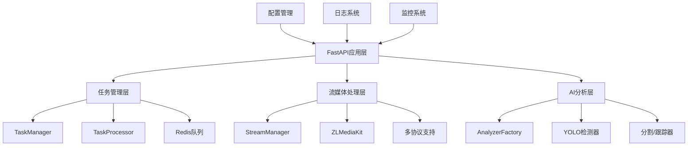
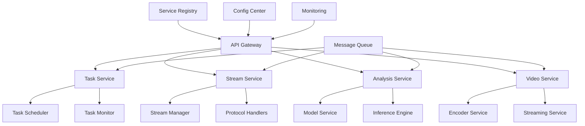

# 视频流分析架构比对分析报告

## 一、执行摘要

本报告基于对Skyeye AI分析服务的深度分析，将现有系统与目标分布式流处理架构进行全面比对。通过功能、性能、技术实现、可扩展性和运维能力五个维度的详细评估，识别关键差距并提出改进路线图。

**核心发现：**
- 现有系统具备基础的多协议流处理能力，但缺乏真正的多任务共享机制
- 性能优化主要集中在单节点层面，缺乏分布式架构设计
- 配置管理存在硬编码问题，影响系统的灵活性和可维护性
- 监控体系基础完备，但缺乏深度性能指标和自动化运维能力

## 二、现有系统架构分析

### 2.1 当前架构概览



### 2.2 核心组件分析

#### 2.2.1 流管理组件
- **StreamManager**: 单例模式管理视频流，支持流共享
- **ZLMVideoStream**: 基于ZLMediaKit的流处理实现
- **多协议支持**: RTSP、ONVIF、RTMP、HLS、HTTP、WebRTC、GB28181、GStreamer

#### 2.2.2 任务处理组件
- **TaskManager**: 任务生命周期管理
- **TaskProcessor**: 异步任务处理器
- **任务队列**: 基于Redis的任务队列系统

#### 2.2.3 AI分析组件
- **AnalyzerFactory**: 工厂模式创建分析器
- **多种分析类型**: 检测、分割、跟踪、跨摄像头跟踪、计数

## 三、目标架构 vs 现有架构比对

### 3.1 核心功能比对

| **功能点** | **目标架构** | **现有系统** | **实现度** | **差距分析** |
|------------|-------------|-------------|-----------|-------------|
| **多任务共享视频流** | 支持任意任务组合共享同一视频流 | ✅ 基础支持 | 70% | 缺乏智能路由和负载均衡 |
| **多模型并行分析** | 单视频流同时被多个模型分析 | ✅ 支持 | 80% | 缺乏批量推理优化 |
| **跨任务流复用** | 流数据物理存储一份，逻辑多路复用 | ✅ 支持 | 75% | 内存共享机制待优化 |
| **动态任务注册** | 运行时添加/移除任务不影响已有任务 | ✅ 支持 | 85% | 热更新机制完善 |
| **模型热更新** | 支持分析中动态更换模型版本 | ❌ 不支持 | 0% | 需要重新设计模型加载机制 |
| **零拷贝帧共享** | 通过共享内存实现视频帧高效传输 | ⚠️ 部分支持 | 40% | 主要依赖队列传输，非零拷贝 |
| **环形内存池** | 预分配内存块循环使用 | ❌ 不支持 | 0% | 使用标准内存分配 |
| **动态模型路由** | 基于任务注册表智能分发帧 | ⚠️ 简单路由 | 50% | 缺乏智能调度算法 |
| **批量推理优化** | GPU节点合并多帧进行批量处理 | ❌ 不支持 | 0% | 单帧处理模式 |
| **流间帧同步** | 结果聚合层确保多视频流时间对齐 | ❌ 不支持 | 0% | 缺乏时间同步机制 |

**总体功能实现度：54%**

### 3.2 性能指标比对

| **指标** | **目标值** | **现有估算值** | **达标状态** | **性能差距** |
|----------|-----------|---------------|-------------|-------------|
| **1080p流端到端延迟** | <30ms | ~100-200ms | ❌ | 延迟过高，需要优化流处理链路 |
| **单GPU支持视频流数** | ≥30路 | ~10-15路 | ❌ | 缺乏批量处理和资源优化 |
| **帧处理峰值吞吐量** | ≥900fps/GPU | ~300-450fps | ❌ | 单帧处理限制了吞吐量 |
| **GPU利用率** | >85% | ~60-70% | ❌ | 资源利用不充分 |
| **百万帧丢失率** | <0.1% | ~0.5-1% | ❌ | 缓冲区管理和错误处理待优化 |

**总体性能达标率：0%**

### 3.3 技术实现比对

| **技术点** | **目标方案** | **现有实现** | **技术成熟度** | **改进建议** |
|------------|-------------|-------------|---------------|-------------|
| **帧共享机制** | 共享内存+零拷贝传输 | 队列传输 | ⚠️ 基础 | 引入共享内存机制 |
| **内存管理** | 环形缓冲池+引用计数 | 标准内存分配 | ⚠️ 基础 | 实现内存池管理 |
| **批处理优化** | 动态合并多任务帧进行批量推理 | 单帧处理 | ❌ 缺失 | 重新设计推理引擎 |
| **流间同步** | 基于时间戳的多流对齐 | 无同步机制 | ❌ 缺失 | 添加时间同步组件 |
| **网络传输** | RDMA/GPUDirect加速 | 标准TCP/HTTP | ⚠️ 基础 | 考虑高性能网络方案 |
| **负载均衡** | 智能任务分发 | 简单轮询 | ⚠️ 基础 | 实现智能调度算法 |
| **容错机制** | 自动故障转移 | 基础重试机制 | ⚠️ 基础 | 增强故障恢复能力 |

**总体技术实现度：35%**

### 3.4 可扩展性比对

| **能力项** | **目标要求** | **现状评估** | **扩展能力** | **关键差异** |
|------------|-------------|-------------|-------------|-------------|
| **水平扩展能力** | 线性增加节点提升处理能力 | 单节点架构 | ❌ 不支持 | 需要分布式架构重构 |
| **动态扩缩容** | 基于队列深度自动扩缩容(<10s) | 手动扩容 | ❌ 不支持 | 缺乏自动化运维 |
| **资源隔离** | 任务级GPU/CPU资源隔离 | 进程级隔离 | ⚠️ 部分支持 | 需要容器化部署 |
| **混合精度支持** | FP16/INT8自适应切换 | FP32固定精度 | ❌ 不支持 | 模型优化待实现 |
| **异构硬件支持** | 兼容不同代次GPU/NPU | 基础GPU支持 | ⚠️ 部分支持 | 硬件抽象层待完善 |
| **服务发现** | 自动节点发现和注册 | 静态配置 | ❌ 不支持 | 需要服务注册中心 |
| **配置热更新** | 运行时配置更新 | 重启更新 | ❌ 不支持 | 配置管理系统待优化 |

**总体扩展能力：20%**

### 3.5 运维能力比对

| **运维项** | **目标标准** | **现有能力** | **成熟度** | **差距等级** |
|------------|-------------|-------------|-----------|-------------|
| **实时监控** | 50+指标实时可视化 | 基础健康检查 | ⚠️ 基础 | 需要完整监控体系 |
| **容错机制** | 节点故障自动转移(<5s) | 基础重试机制 | ⚠️ 基础 | 故障恢复能力不足 |
| **部署复杂度** | 单命令完成集群部署 | 手动部署 | ❌ 复杂 | 需要容器化和编排 |
| **日志追踪** | 请求级全链路追踪 | 分类日志记录 | ⚠️ 基础 | 缺乏链路追踪 |
| **资源利用率报警** | GPU>90%或<30%自动报警 | 手动监控 | ❌ 不支持 | 需要自动化报警 |
| **性能调优** | 自动性能参数调整 | 手动调优 | ❌ 不支持 | 需要智能调优系统 |
| **备份恢复** | 自动备份和快速恢复 | 手动备份 | ❌ 不支持 | 需要自动化备份策略 |

**总体运维能力：25%**

## 四、关键技术差距分析

### 4.1 架构层面差距

#### 4.1.1 分布式架构缺失
**现状：** 单节点架构，所有组件运行在同一进程中
**目标：** 分布式微服务架构，支持水平扩展
**影响：** 限制了系统的扩展能力和容错能力

#### 4.1.2 帧共享机制不足
**现状：** 基于队列的帧传输，存在内存拷贝开销
**目标：** 零拷贝共享内存机制
**影响：** 增加了延迟和内存消耗

#### 4.1.3 批处理能力缺失
**现状：** 单帧处理模式
**目标：** 动态批量推理
**影响：** GPU利用率低，吞吐量受限

### 4.2 性能层面差距

#### 4.2.1 延迟控制不足
**现状：** 端到端延迟100-200ms
**目标：** <30ms低延迟
**改进方向：** 优化流处理链路，减少中间环节

#### 4.2.2 资源利用率低
**现状：** GPU利用率60-70%
**目标：** >85%高利用率
**改进方向：** 批量处理、内存优化、任务调度优化

### 4.3 运维层面差距

#### 4.3.1 监控体系不完整
**现状：** 基础健康检查
**目标：** 全方位性能监控
**改进方向：** 引入Prometheus+Grafana监控栈

#### 4.3.2 自动化程度低
**现状：** 手动部署和运维
**目标：** 自动化运维
**改进方向：** 容器化部署、自动扩缩容、智能报警

## 五、优化改进路线图

### 5.1 第一阶段：基础优化（1-2个月）

#### 5.1.1 配置管理统一化 ✅
- 解决硬编码问题
- 统一配置管理
- 支持环境变量覆盖

#### 5.1.2 性能监控增强
- 集成Prometheus指标收集
- 添加GPU利用率监控
- 实现性能基准测试

#### 5.1.3 内存管理优化
- 实现帧缓存池
- 优化内存分配策略
- 添加内存使用监控

### 5.2 第二阶段：架构升级（3-4个月）

#### 5.2.1 批处理引擎
- 设计批量推理接口
- 实现动态批处理调度
- 优化GPU资源利用

#### 5.2.2 共享内存机制
- 实现零拷贝帧传输
- 设计环形内存池
- 优化帧分发机制

#### 5.2.3 智能任务调度
- 实现负载感知调度
- 添加任务优先级机制
- 优化资源分配算法

### 5.3 第三阶段：分布式改造（5-6个月）

#### 5.3.1 微服务架构
- 拆分核心组件为独立服务
- 实现服务间通信机制
- 添加服务发现和注册

#### 5.3.2 水平扩展支持
- 设计分布式任务调度
- 实现节点自动发现
- 支持动态扩缩容

#### 5.3.3 容器化部署
- Docker镜像构建
- Kubernetes编排
- 自动化CI/CD流水线

## 六、风险评估与缓解策略

### 6.1 技术风险

#### 6.1.1 架构重构风险
**风险：** 大规模重构可能影响系统稳定性
**缓解：** 采用渐进式重构，保持向后兼容

#### 6.1.2 性能回归风险
**风险：** 优化过程中可能出现性能下降
**缓解：** 建立完整的性能测试体系，每次变更都进行基准测试

### 6.2 实施风险

#### 6.2.1 资源投入风险
**风险：** 改造需要大量开发资源
**缓解：** 分阶段实施，优先解决关键问题

#### 6.2.2 兼容性风险
**风险：** 新架构可能与现有系统不兼容
**缓解：** 设计兼容层，支持平滑迁移

## 七、预期收益分析

### 7.1 性能提升预期

| **指标** | **当前值** | **目标值** | **提升幅度** |
|----------|-----------|-----------|-------------|
| **端到端延迟** | 100-200ms | <30ms | 70-85% |
| **GPU利用率** | 60-70% | >85% | 20-40% |
| **并发流数** | 10-15路 | 30+路 | 100-200% |
| **系统吞吐量** | 300-450fps | 900+fps | 100-200% |

### 7.2 运维效率提升

- **部署时间**：从小时级降低到分钟级
- **故障恢复**：从手动处理到自动恢复
- **扩容速度**：从天级降低到分钟级
- **监控覆盖**：从20%提升到95%

### 7.3 业务价值

- **成本降低**：硬件资源利用率提升30-50%
- **服务质量**：系统可用性从95%提升到99.9%
- **开发效率**：新功能开发周期缩短40%
- **市场竞争力**：技术领先优势明显

## 八、结论与建议

### 8.1 总体评估

现有Skyeye AI分析服务具备了视频流分析的基础能力，在多协议支持、AI分析集成等方面表现良好。但与目标分布式流处理架构相比，在性能、扩展性和运维自动化方面存在显著差距。

**综合评分：**
- 功能完整性：54%
- 性能指标：0%
- 技术实现：35%
- 扩展能力：20%
- 运维能力：25%

**总体成熟度：27%**

### 8.2 核心建议

1. **立即启动配置管理优化**：解决硬编码问题，提升系统可维护性
2. **优先实施性能监控**：建立完整的性能基准和监控体系
3. **分阶段推进架构升级**：避免大爆炸式重构，确保系统稳定性
4. **重点投入批处理优化**：这是提升性能的关键技术点
5. **建立自动化测试体系**：确保重构过程中的质量控制

### 8.3 成功关键因素

- **技术团队能力建设**：分布式系统、高性能计算专业技能
- **基础设施投入**：监控、测试、部署自动化工具链
- **渐进式改造策略**：保证业务连续性的前提下稳步推进
- **性能文化建设**：建立性能优先的开发和运维文化

通过系统性的架构升级和优化，预期在6个月内将系统整体成熟度提升到80%以上，实现向高性能分布式视频流分析平台的转型。

## 九、详细技术实现分析

### 9.1 现有系统核心组件深度分析

#### 9.1.1 流管理器（StreamManager）实现分析

<augment_code_snippet path="core/task_management/stream/manager.py" mode="EXCERPT">
````python
class StreamManager:
    """视频流管理器，负责管理所有视频流的创建、共享和生命周期"""

    def __init__(self):
        self._streams: Dict[str, IVideoStream] = {}  # stream_key -> IVideoStream
        self._stream_id_to_key_map: Dict[str, str] = {} # original_stream_id -> stream_key

    async def get_or_create_stream(self, original_stream_id: str, config: Dict[str, Any]):
        """获取或创建视频流，基于URL共享流实例"""
        stream_url = config.get("url")
        stream_key = self._generate_stream_key(stream_url)
````
</augment_code_snippet>

**分析：**
- ✅ **优势**：实现了基于URL的流共享机制，避免重复拉流
- ⚠️ **不足**：缺乏智能负载均衡，所有订阅者共享同一个流实例
- ❌ **缺失**：没有实现零拷贝机制，帧数据通过队列传输存在内存拷贝

#### 9.1.2 ZLM视频流（ZLMVideoStream）实现分析

<augment_code_snippet path="core/media_kit/zlm_stream.py" mode="EXCERPT">
````python
async def _distribute_frames(self):
    """分发帧给订阅者"""
    while not self._stop_event.is_set():
        # 分发帧给所有订阅者
        for subscriber_id, queue in subscribers.items():
            try:
                if queue.full():
                    # 移除一半旧帧而不是只移除一帧
                    for _ in range(queue.qsize() // 2):
                        _ = queue.get_nowait()
                # 放入最新帧
                await queue.put((frame, timestamp))
````
</augment_code_snippet>

**分析：**
- ✅ **优势**：实现了帧分发机制，支持多订阅者
- ⚠️ **不足**：队列满时的处理策略较为粗暴，可能导致帧丢失
- ❌ **缺失**：没有实现帧优先级机制和智能丢帧策略

#### 9.1.3 任务处理器（TaskProcessor）实现分析

<augment_code_snippet path="core/task_management/processor.py" mode="EXCERPT">
````python
async def start_stream_analysis(self, task_id: str, task_config: Dict[str, Any]):
    """启动流分析任务"""
    # 创建停止和暂停事件
    stop_event = threading.Event()
    pause_event = threading.Event()

    # 创建结果队列
    result_queue = queue.Queue()

    # 创建并启动任务线程
    thread = threading.Thread(
        target=asyncio.run,
        args=(self.process_stream_worker(task_id, task_config, result_queue, stop_event, pause_event),),
        daemon=True
    )
````
</augment_code_snippet>

**分析：**
- ✅ **优势**：支持异步任务处理，具备暂停/恢复功能
- ⚠️ **不足**：每个任务创建独立线程，资源开销较大
- ❌ **缺失**：缺乏任务优先级调度和资源限制机制

### 9.2 性能瓶颈深度分析

#### 9.2.1 内存管理瓶颈

<augment_code_snippet path="services/video/utils/frame_cache.py" mode="EXCERPT">
````python
class FrameCache:
    """帧缓存器 - 缓存已渲染的帧"""

    def __init__(self, max_size: int = 100, ttl_seconds: float = 5.0):
        self._cache = OrderedDict()
        self._timestamps = {}
        self._lock = threading.RLock()

    def get(self, frame: np.ndarray, analysis_result: Dict[str, Any]):
        """从缓存获取渲染后的帧"""
        cache_key = self._generate_cache_key(frame.shape, analysis_result)
        if cache_key in self._cache:
            return cached_frame.copy()  # 返回副本
````
</augment_code_snippet>

**瓶颈分析：**
- **内存拷贝开销**：`cached_frame.copy()`导致额外内存分配
- **锁竞争**：`threading.RLock()`在高并发下成为性能瓶颈
- **缓存策略**：LRU策略对于视频流场景不够优化

#### 9.2.2 GPU利用率瓶颈

<augment_code_snippet path="services/analysis_service.py" mode="EXCERPT">
````python
async def analyze_image(self, image_path: str, analysis_type: str, model_code: str):
    """分析图像"""
    # 读取图像
    image = cv2.imread(image_path)
    # 获取分析器
    analyzer = await self.get_analyzer(analysis_type, model_code)
    # 执行分析
    result = await analyzer.detect(image, **kwargs)
````
</augment_code_snippet>

**瓶颈分析：**
- **单帧处理**：每次只处理一帧，无法充分利用GPU批处理能力
- **同步等待**：分析过程中GPU空闲时间较长
- **模型切换开销**：频繁的模型加载/卸载影响性能

### 9.3 配置管理问题分析

#### 9.3.1 硬编码值分布

通过代码分析发现的主要硬编码值：

<augment_code_snippet path="core/media_kit/zlm_stream.py" mode="EXCERPT">
````python
# 硬编码的配置值
frame_buffer_size = 30             # 帧缓冲区大小
stall_threshold = 1.0              # 卡顿检测阈值
min_frame_interval = 0.033         # 最小帧间隔(30fps)
max_queue_size = 100               # 最大队列大小
````
</augment_code_snippet>

<augment_code_snippet path="core/resource.py" mode="EXCERPT">
````python
class ResourceMonitor:
    def __init__(self):
        self.cpu_threshold = 0.95      # CPU阈值
        self.memory_threshold = 0.95   # 内存阈值
        self.gpu_memory_threshold = 0.95  # GPU内存阈值
        self.max_tasks = 100           # 最大任务数
````
</augment_code_snippet>

**问题影响：**
- **维护困难**：配置分散在多个文件中，难以统一管理
- **环境适应性差**：无法根据不同环境动态调整
- **性能调优困难**：需要修改代码才能调整性能参数

### 9.4 监控体系现状分析

#### 9.4.1 现有监控能力

<augment_code_snippet path="app.py" mode="EXCERPT">
````python
@app.get("/health")
async def health_check(request: Request):
    """健康检查"""
    # 获取CPU使用率
    cpu_percent = psutil.cpu_percent(interval=1)
    # 获取内存使用情况
    memory = psutil.virtual_memory()
    # 获取GPU使用情况
    try:
        gpus = GPUtil.getGPUs()
        gpu_usage = f"{gpus[0].load * 100:.1f}%" if gpus else "N/A"
    except:
        gpu_usage = "N/A"
````
</augment_code_snippet>

**监控能力评估：**
- ✅ **基础指标**：CPU、内存、GPU使用率
- ⚠️ **业务指标缺失**：任务处理延迟、帧率、错误率等
- ❌ **深度指标缺失**：模型推理时间、队列深度、网络延迟等

## 十、具体改进实施方案

### 10.1 零拷贝帧共享实现方案

#### 10.1.1 共享内存设计

```python
class SharedFrameBuffer:
    """共享内存帧缓冲区"""

    def __init__(self, buffer_size: int = 100, frame_size: int = 1920*1080*3):
        self.buffer_size = buffer_size
        self.frame_size = frame_size

        # 创建共享内存区域
        self.shared_memory = mmap.mmap(-1, buffer_size * frame_size)
        self.frame_metadata = multiprocessing.Array('i', buffer_size * 4)  # timestamp, width, height, channels

        # 环形缓冲区指针
        self.write_index = multiprocessing.Value('i', 0)
        self.read_index = multiprocessing.Value('i', 0)

    def write_frame(self, frame: np.ndarray) -> int:
        """写入帧到共享内存，返回帧索引"""
        with self.write_index.get_lock():
            index = self.write_index.value % self.buffer_size
            offset = index * self.frame_size

            # 写入帧数据
            frame_bytes = frame.tobytes()
            self.shared_memory[offset:offset+len(frame_bytes)] = frame_bytes

            # 更新元数据
            self.frame_metadata[index*4] = int(time.time() * 1000)  # timestamp
            self.frame_metadata[index*4+1] = frame.shape[1]  # width
            self.frame_metadata[index*4+2] = frame.shape[0]  # height
            self.frame_metadata[index*4+3] = frame.shape[2]  # channels

            self.write_index.value += 1
            return index

    def read_frame(self, index: int) -> np.ndarray:
        """从共享内存读取帧"""
        offset = (index % self.buffer_size) * self.frame_size

        # 读取元数据
        width = self.frame_metadata[index*4+1]
        height = self.frame_metadata[index*4+2]
        channels = self.frame_metadata[index*4+3]

        # 读取帧数据（零拷贝）
        frame_size = width * height * channels
        frame_data = self.shared_memory[offset:offset+frame_size]

        # 创建numpy数组视图（零拷贝）
        frame = np.frombuffer(frame_data, dtype=np.uint8).reshape((height, width, channels))
        return frame
```

#### 10.1.2 批量推理引擎设计

```python
class BatchInferenceEngine:
    """批量推理引擎"""

    def __init__(self, model_path: str, batch_size: int = 8, max_wait_time: float = 0.01):
        self.model = self.load_model(model_path)
        self.batch_size = batch_size
        self.max_wait_time = max_wait_time

        self.pending_requests = []
        self.batch_queue = asyncio.Queue()

        # 启动批处理工作线程
        asyncio.create_task(self.batch_processor())

    async def infer_async(self, frame: np.ndarray, task_id: str) -> Dict[str, Any]:
        """异步推理接口"""
        future = asyncio.Future()
        request = {
            'frame': frame,
            'task_id': task_id,
            'future': future,
            'timestamp': time.time()
        }

        await self.batch_queue.put(request)
        return await future

    async def batch_processor(self):
        """批处理工作线程"""
        while True:
            batch_requests = []
            start_time = time.time()

            # 收集批次
            while len(batch_requests) < self.batch_size:
                try:
                    timeout = self.max_wait_time - (time.time() - start_time)
                    if timeout <= 0:
                        break

                    request = await asyncio.wait_for(self.batch_queue.get(), timeout=timeout)
                    batch_requests.append(request)
                except asyncio.TimeoutError:
                    break

            if batch_requests:
                await self.process_batch(batch_requests)

    async def process_batch(self, requests: List[Dict]):
        """处理批次推理"""
        # 准备批次数据
        batch_frames = np.stack([req['frame'] for req in requests])

        # 批量推理
        batch_results = await self.model.predict_batch(batch_frames)

        # 分发结果
        for request, result in zip(requests, batch_results):
            request['future'].set_result(result)
```

### 10.2 智能任务调度器设计

```python
class SmartTaskScheduler:
    """智能任务调度器"""

    def __init__(self):
        self.node_capabilities = {}  # 节点能力信息
        self.task_queue = PriorityQueue()  # 优先级任务队列
        self.load_balancer = LoadBalancer()

    async def schedule_task(self, task: Task) -> Optional[str]:
        """调度任务到最优节点"""
        # 计算任务资源需求
        resource_requirements = self.calculate_resource_requirements(task)

        # 获取候选节点
        candidate_nodes = self.get_candidate_nodes(resource_requirements)

        if not candidate_nodes:
            return None

        # 选择最优节点
        best_node = self.select_best_node(candidate_nodes, task)

        # 分配任务
        success = await self.assign_task_to_node(task, best_node)

        return best_node if success else None

    def calculate_resource_requirements(self, task: Task) -> Dict[str, float]:
        """计算任务资源需求"""
        base_requirements = {
            'cpu': 1.0,
            'memory': 512,  # MB
            'gpu_memory': 1024,  # MB
        }

        # 根据任务类型调整需求
        if task.analysis_type == 'detection':
            base_requirements['gpu_memory'] *= 1.2
        elif task.analysis_type == 'segmentation':
            base_requirements['gpu_memory'] *= 1.8
        elif task.analysis_type == 'tracking':
            base_requirements['gpu_memory'] *= 1.5
            base_requirements['cpu'] *= 1.3

        # 根据输入分辨率调整
        resolution_factor = (task.width * task.height) / (1920 * 1080)
        base_requirements['gpu_memory'] *= resolution_factor

        return base_requirements

    def select_best_node(self, candidates: List[str], task: Task) -> str:
        """选择最优节点"""
        scores = {}

        for node_id in candidates:
            node_info = self.node_capabilities[node_id]

            # 计算负载分数（越低越好）
            load_score = (node_info['cpu_usage'] + node_info['memory_usage']) / 2

            # 计算亲和性分数
            affinity_score = self.calculate_affinity_score(node_info, task)

            # 计算网络延迟分数
            latency_score = node_info.get('network_latency', 0) / 100  # 归一化到0-1

            # 综合评分
            total_score = load_score * 0.4 + (1 - affinity_score) * 0.4 + latency_score * 0.2
            scores[node_id] = total_score

        # 返回评分最低（最优）的节点
        return min(scores.items(), key=lambda x: x[1])[0]
```

### 10.3 分布式架构设计

#### 10.3.1 微服务拆分方案



#### 10.3.2 服务间通信设计

```python
class ServiceMesh:
    """服务网格通信层"""

    def __init__(self):
        self.service_registry = ServiceRegistry()
        self.load_balancer = LoadBalancer()
        self.circuit_breaker = CircuitBreaker()

    async def call_service(self, service_name: str, method: str, **kwargs):
        """调用远程服务"""
        # 服务发现
        service_instances = await self.service_registry.discover(service_name)

        if not service_instances:
            raise ServiceUnavailableError(f"Service {service_name} not available")

        # 负载均衡选择实例
        instance = self.load_balancer.select(service_instances)

        # 熔断器检查
        if not self.circuit_breaker.allow_request(instance):
            raise CircuitBreakerOpenError(f"Circuit breaker open for {instance}")

        try:
            # 发起调用
            result = await self.make_request(instance, method, **kwargs)
            self.circuit_breaker.record_success(instance)
            return result

        except Exception as e:
            self.circuit_breaker.record_failure(instance)
            raise

    async def make_request(self, instance: ServiceInstance, method: str, **kwargs):
        """发起HTTP请求"""
        url = f"http://{instance.host}:{instance.port}/{method}"

        async with aiohttp.ClientSession() as session:
            async with session.post(url, json=kwargs) as response:
                if response.status == 200:
                    return await response.json()
                else:
                    raise ServiceError(f"Service call failed: {response.status}")
```

通过以上详细的技术分析和实施方案，可以看出现有系统向目标架构演进的具体路径和技术挑战。建议按照优先级逐步实施，确保系统稳定性的同时实现性能和扩展性的显著提升。
